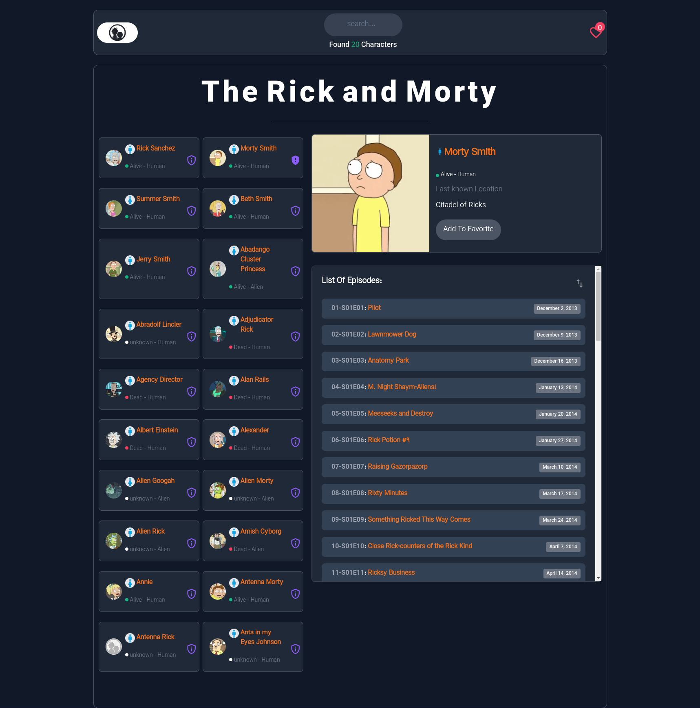
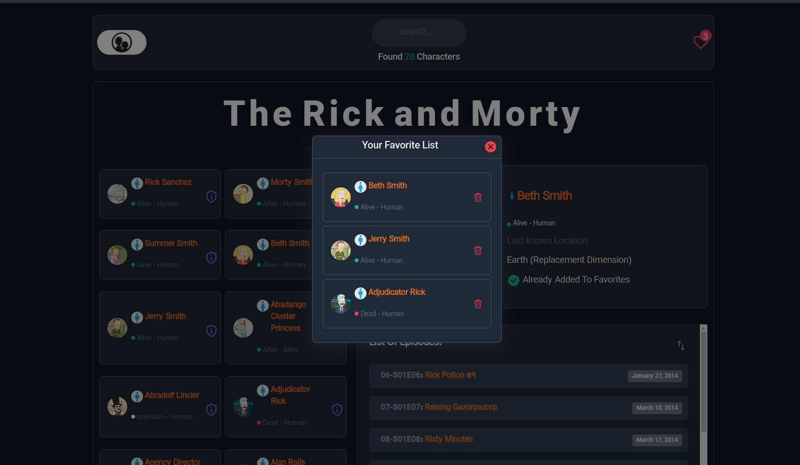

  <a href="#">
    
    <h2 align="center">The Rick and Morty</h2>
  </a>

# Screen Shot

---

Develop with ReactJS, Tailwindcss, Mui

# APP Features

<ul>
<li>Get and show all characters</li>
<li>Show count of characters in header</li>
<li>You can search for characters</li>
<li>Show character details</li>
<li>Get and show character episodes</li>
<li>You can sort episodes by date</li>
<li>You can add characters to favorite list</li>
<li>You can visit favorite list</li>
<li>You can visit favorite list after refresh</li>
<li>You can delete item of favorite list</li>
</ul>

---

# APP Link

[rickmorty.ghorbani-dev.ir](https://rickmorty.ghorbani-dev.ir/)

---

Made with :heart: by Ghorbani-Dev1985