

  <a href="#">
    
    <h2 align="center">Freelancers | فریلنسرز</h2>
  </a>

# Screen SHOTS

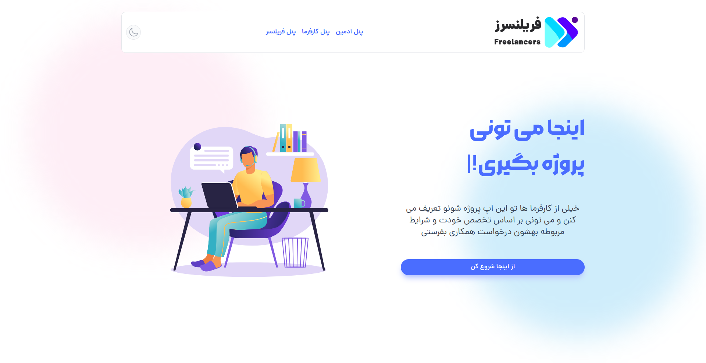
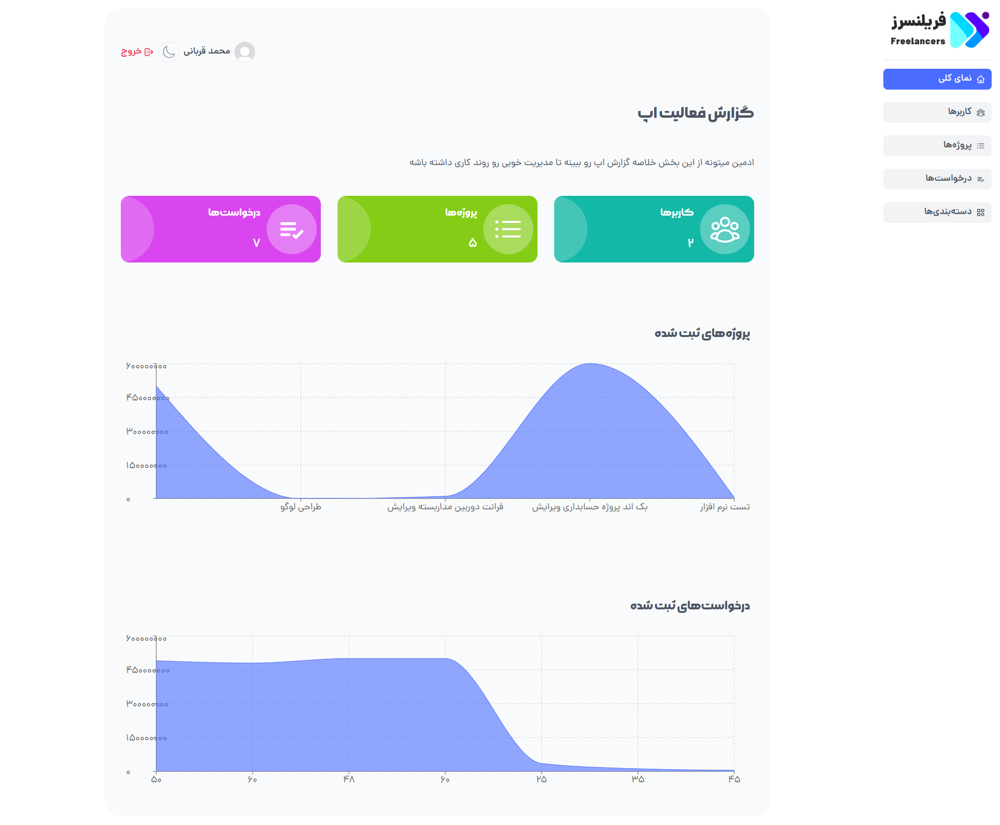

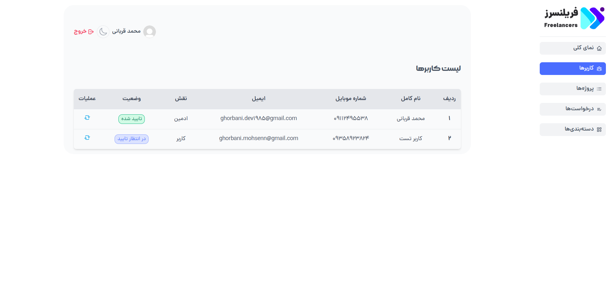
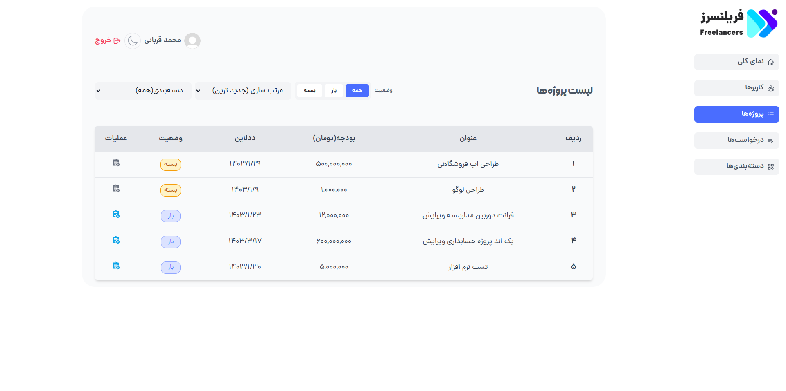

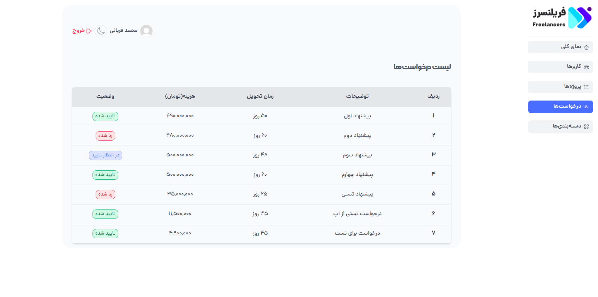
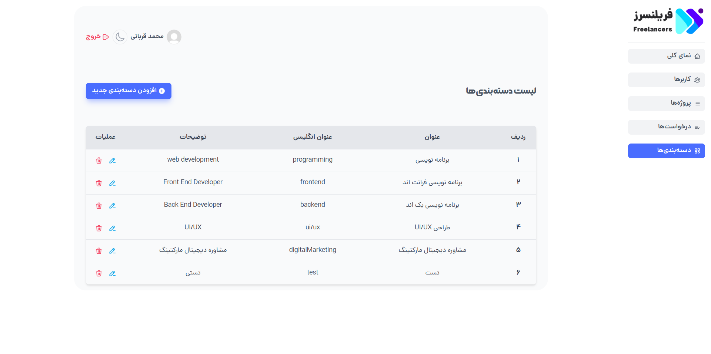

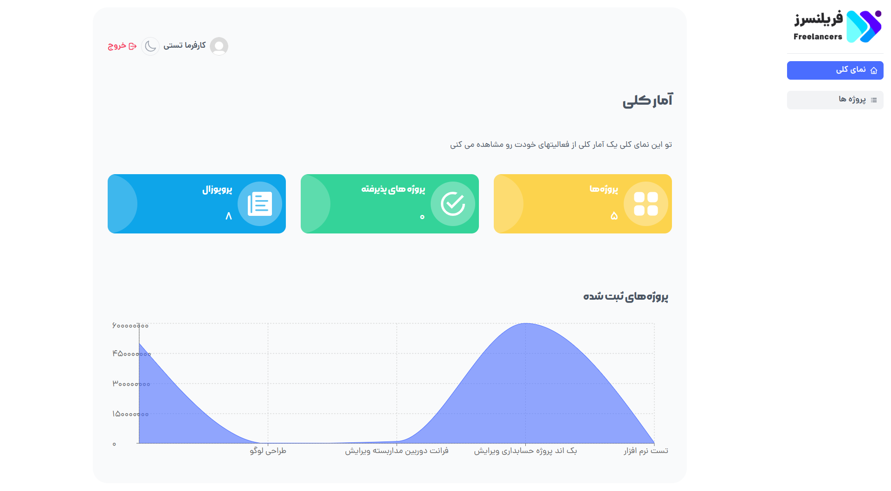
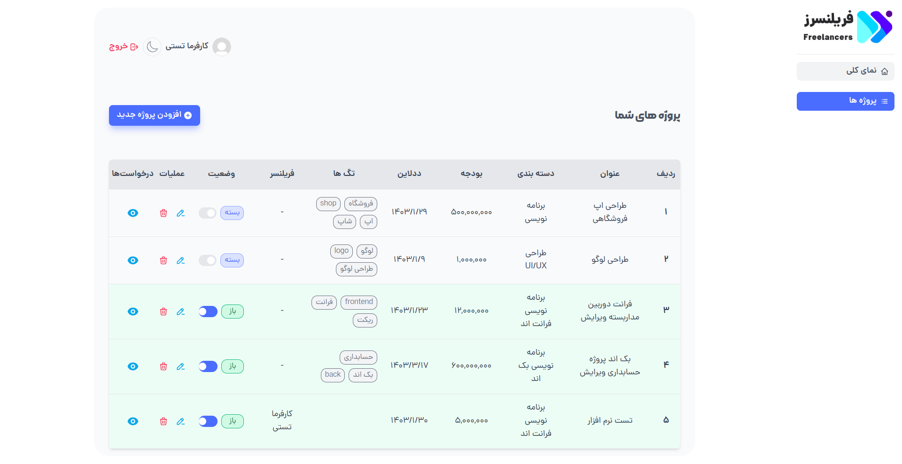

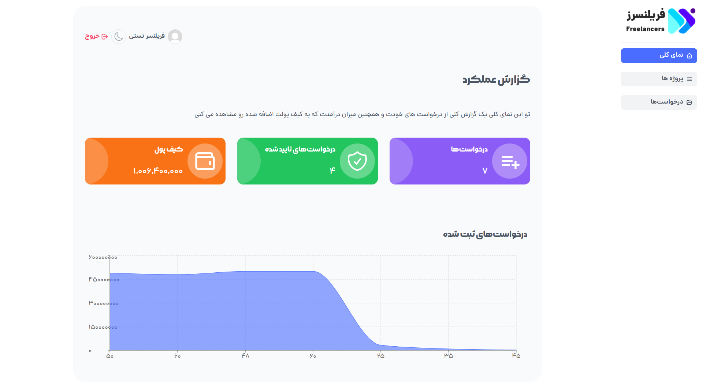
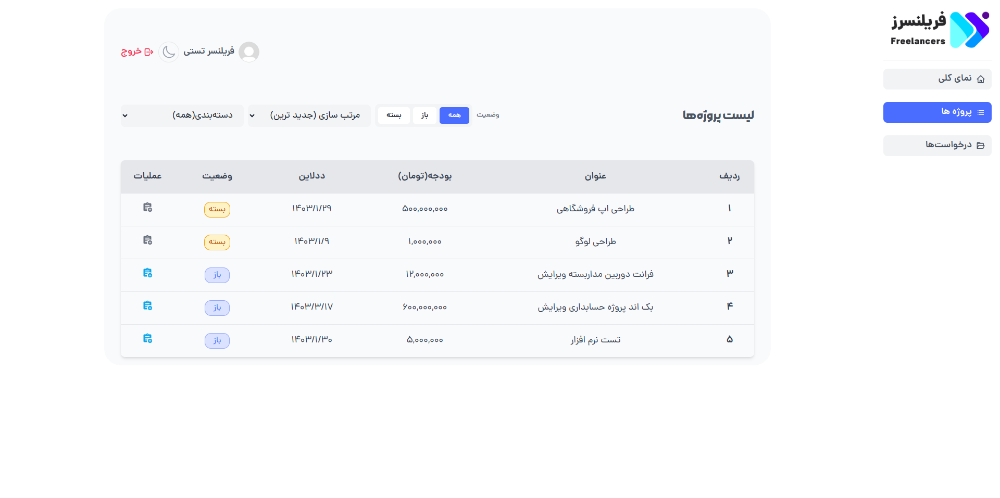

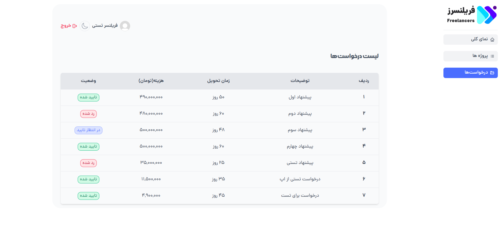

---

Fullstack app with NodeJS, MongoDB, ReactJS, TailwindCss

# APP Features

<ul>
<li>Login & Register with phone number</li>
<li>Admin can check report of app</li>
<li>Admin can see list of users</li>
<li>Admin can change of users status</li>
<li>Admin can filter projects</li>
<li>Admin can edit projects</li>
<li>Admin can see all proposals</li>
<li>Admin can see all categories</li>
<li>Admin can add new category</li>
<li>Admin can edit category</li>
<li>Admin can delete category</li>
<li>Owner can check report of projects</li>
<li>Owner can add new project</li>
<li>Owner can see all projects</li>
<li>Owner can change of project status</li>
<li>Owner can edit project</li>
<li>Owner can delete project</li>
<li>Owner can see details of proposals for projects</li>
<li>Owner can change of proposals status</li>
<li>Freelancer can check report of proposals</li>
<li>Freelancer can see all projects</li>
<li>Freelancer can filter projects</li>
<li>Freelancer can add new proposal for projects</li>
<li>Freelancer can see all proposals</li>
<li>Dark mode</li>
</ul>

---

# APP Link

[sabzlearn.ghorbani-dev.ir](https://freelancers.ghorbani-dev.ir/)

---

Made with :heart: by Ghorbani-Dev1985